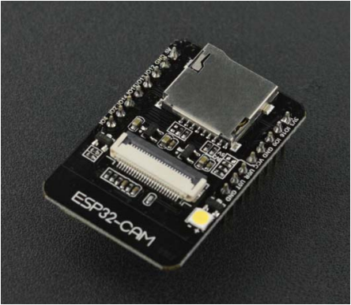
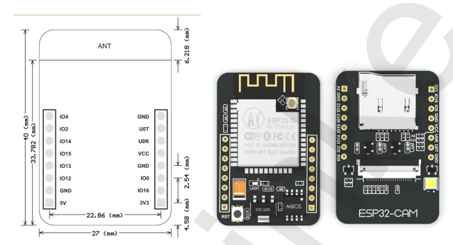
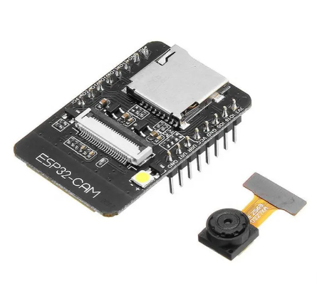
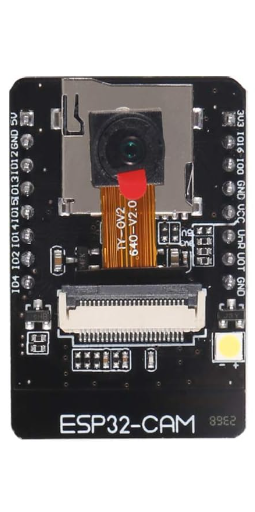
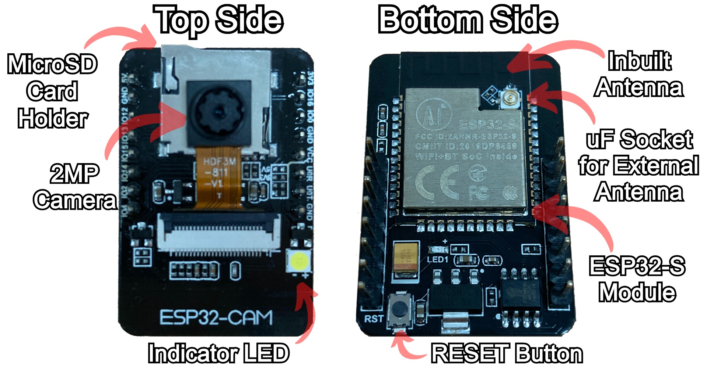

# **La carte de développement ESP32 CAM**

# **1. Introduction :**

ESP32-CAM est une carte de développement basée sur ESP32 à faible coût avec caméra intégrée, de petite taille
taille. C'est une solution idéale pour les applications IoT.
  
Le module caméra de petite taille très compétitif peut fonctionner indépendamment comme un système minimum avec un empreinte de seulement 27*40,5*4,5mm .

L'ESP-32CAM peut être largement utilisé dans diverses applications IoT. Il convient aux appareils intelligents domestiques, au contrôle sans fil industriel, à la surveillance sans fil, à l'identification sans fil QR, aux signaux du système de positionnement sans fil et à d'autres applications IoT. C'est une solution idéale pour les applications IoT.

# **2. Caractéristiques:**
<ul>

<li> Le plus petit module SoC Wi-Fi BT 802.11b/g/n</li>
<li> Processeur 32 bits basse consommation, peut également servir le processeur d'application
</li>
<li> Vitesse d'horloge jusqu'à 160 MHz, puissance de calcul récapitulative jusqu'à 600 DMIPS
</li>
<li> SRAM intégrée de 520 Ko, 4MPSRAM externe
</li>
<li> Prend en charge UART/SPI/I2C/PWM/ADC/DAC
</li>
<li> Prend en charge les caméras OV2640 et OV7670, lampe flash intégrée.
</li>
<li> Prise en charge du téléchargement d'images WiFi
</li>
<li> Prise en charge de la carte TF (TransFlash)</li>

</ul>
 

|  Les caméras OV2460 et l'ESP32CAM :  |   |
|---|---|
|  | .jpg)|

# **3. Spécifications:**
|   |   |
|---|---|
| Module model | ESP32-CAM|
| Package | DIP-16 |
| Taille | 27\*40.5\*4.5(±0.23mm) |
| SPI Flash | DIP-16 |
| Package | 32Mbit par défaut|
| RAM | 520KB SRAM +4M PSRAM|
| Bluetooth | Bluetooth 4.2 BR/EDR and BLE standards |
| Wi-Fi | 802.11 b/g/n/ |
| Support interface | UART, SPI, I2C, PWM |
| Support TF card | Maximum supporte 4G |
| IO port | 9|
| UART Baudrate | 115200 bps par défaut|
| Image Output Format | JPEG(OV2640 support only ),BMP,GRAYSCALE |
| Intervalle du spectre | 2412 ~2484MHz |
| Antenne | antenne PCB sur carte , gain 2dBi |
| Puissance de transmission | 802.11b: 17±2 dBm (à 11Mbps)   802.11g: 14±2 dBm (à 54Mbps)   802.11n: 13±2 dBm (à MCS7) |
| Sensibilité de réception | CCK, 1 Mbps : -90dBm   CCK, 11 Mbps: -85dBm   6 Mbps (1/2 BPSK): -88dBm   54 Mbps (3/4 64-QAM): -70dBm   MCS7 (65 Mbps, 72.2 Mbps): -67dBm |
| Dissipation de puissance | Éteignage de la lampe flash : 180mA à 5V   Allumez la lampe flash et allumez la luminosité au maximum : 310 mA à 5 V |
| Gamme d'alimentation | 5V |

# **4. Brochage :**

|  Les broches de la carte |   |
|---|---|
|  | |

Ci-dessous la liste des pins les plus imporants de la carte de développement ESP32-CAM et leurs fonctionnalités

<ul>
<li> L'alimentation 5V ou 3.3V : assurer l'alimentation de la carte </li>
<li> La masse (GND) : le module masse de la carte </li>
<li> Les broches E/S (IO) (du haut vers le bas, de gauche à droite):
    <ul>
    <li> IO12 </li>
    <li> IO13 </li>
    <li> IO15 </li>
    <li> IO14 </li>
    <li> IO2 </li>
    <li> IO4 </li>
    <li> IO0 </li>
    <li> IO16 </li>
    </ul>
</li>
<li> Les broches de transmission/réception du module UART :
 <ul>
    <li> U0T </li>
    <li> U0R </li>
    </ul>
</li>
<li> VCC </li>
</ul>

La figure ci-dessous représente d'autres types de composants, tel que le porte-carte MicroSD, la caméra, la flash LED, le bouton <b><i>reset</i></b>, le module ESP32-S, <b><i> connecteur uf pour antenne externe</i></b> et une <b><i>antenne intégrée</i></b>

# **Références :**
<a href = "https://loboris.eu/ESP32/ESP32-CAM%20Product%20Specification.pdf" > https://loboris.eu/ESP32/ESP32-CAM%20Product%20Specification.pdf </a>
<a href = "https://media.digikey.com/pdf/Data%20Sheets/DFRobot%20PDFs/DFR0602_Web.pdf
" > https://media.digikey.com/pdf/Data%20Sheets/DFRobot%20PDFs/DFR0602_Web.pdf
 </a>

